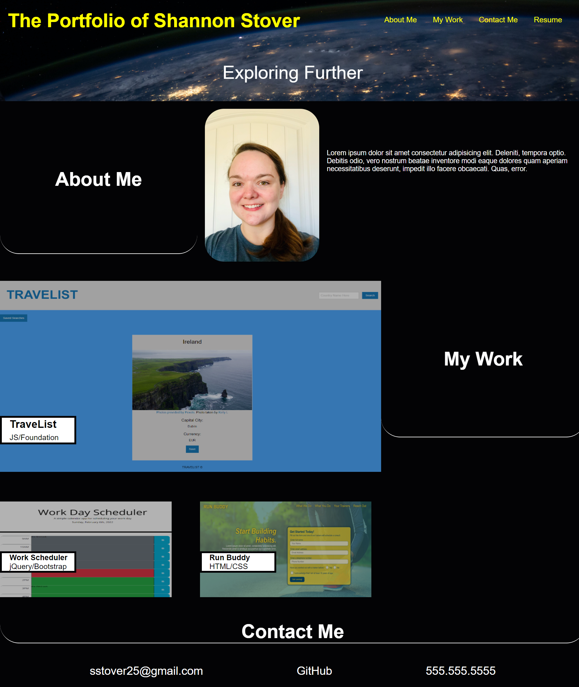
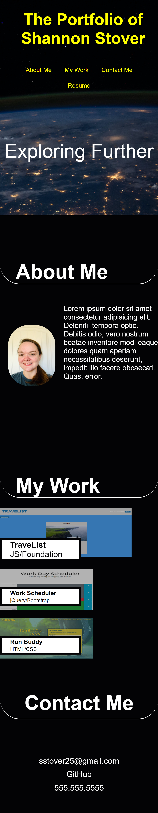

# Advanced CSS Challenge: Professional Portfolio

## Description

```
This is the first professional portfolio I've made as a web developer-in-training.
It uses HTML and CSS. It contains my first application as well as placeholders for upcoming applications.

```

## User Story

```
AS AN employer
I WANT to view a potential employee's deployed portfolio of work samples
SO THAT I can review samples of their work and assess whether they're a good candidate for an open position

```

## Acceptance Criteria

```
- It is done when I have included my name, a recent photo, and
links to sections about me, my work, and how to contact me.

- It is done when I have created functionality that lets users click on a
link in the navigation bar and it takes them to that section on the webpage.

- It is done when I have created functionailty that, when they click on the
link to the section about my work, it takes users to a section with titled
images of my applications.

- It is done when I have made my first application's image larger in size than the others.

- It is done when I have created functionality that lets users click on the
images of the applications, which then takes the users to that deployed application.

- It is done when I have created a responsive layout that adapts to the users viewport size.
```

The following image demonstrates the application functionality in a browser:


The following image demonstrates the application functionality on mobile:


```

## Review

- The URL of the deployed application: https://sstover25.github.io/Professional_Portfolio/

- The URL of the GitHub repository: https://github.com/sstover25/Professional_Portfolio

```

## Credits

```

Hero image copyright of NASA (access via Unsplash): https://unsplash.com/photos/Q1p7bh3SHj8

Coding assistance from KU bootcamp modules, https://www.w3schools.com, https://developer.mozilla.org/, and Stack Overflow.

```

---

```

```
